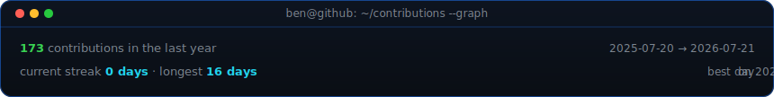

<!-- Profile README for github.com/belykben/belykben -->

<table>
<tr>
<td valign="top"></td>
<td valign="top"></td>
</tr>
</table>

  

  

 

Hi! I’m a Full Stack Python Developer specializing in building database-driven web applications and AI-powered products. Over the past 3 years, I've focused on engineering clean backend APIs with FastAPI, crafting modern React/TypeScript interfaces, and orchestration of LLM workflows using LangChain and LangGraph. I thrive in event-driven environments utilizing Kafka, Docker, and Kubernetes.

 

<!-- animated contribution graph, refreshed daily by the workflow -->
<picture>
  <source media="(prefers-color-scheme: dark)" srcset="https://raw.githubusercontent.com/belykben/belykben/output/github-contribution-grid-snake-dark.svg" />
  <source media="(prefers-color-scheme: light)" srcset="https://raw.githubusercontent.com/belykben/belykben/output/github-contribution-grid-snake.svg" />
  
</picture>

 

